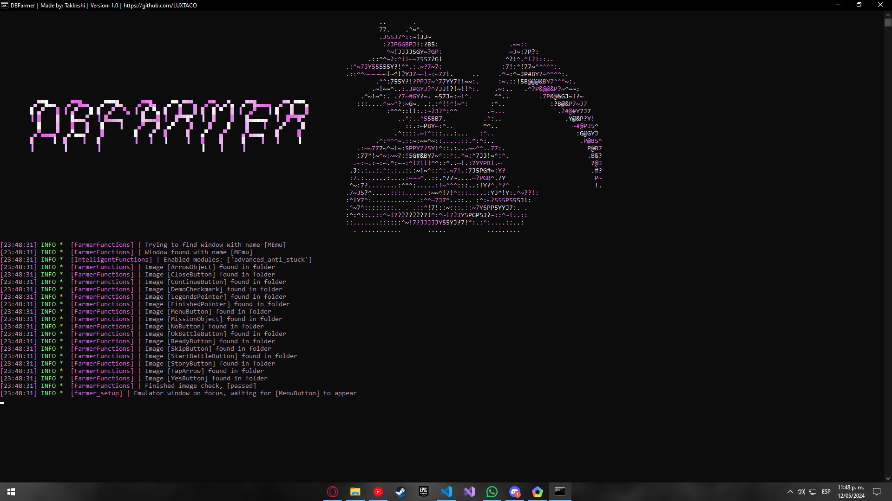

----

  

----
### 
🤖 DBFarmer 🤖

 

  Before you read anything else, If you are looking for the <strong>FULL IN DEPTH</strong> explanation on how this works check out my <a href="https://youtube.com/@takkeshi_dev">channel</a> in which Ill try to upload the in depth explanation of most of my scripts!
    
  DBFarmer is a tool that completes the story of Dragon Ball Legends autonomously with setting for human assistance and auto anti stuck measures.

----

### 
🧬 Installation 🧬

 

  <strong>Python Script:</strong>
    
  - For the python script you just need to start it and the libraries should auto download.
  - Once they auto download you should be good to go!
  
  <strong>DBLegends:</strong>
  
  - Make sure your game is in english.
  - ake sure you are on the main menu.
  - Make sure the images line up in game.
  
  <strong>Extras:</strong>
  
  - Make sure to not have hdr on!

----
### 
⛑ How it works ⛑

 

  To use DBLegends, you need to run the following command in the project directory:
  
    python main.py
  
  Doing so will activate the script and complete the story for you. You can adjust the settings in the config file to customize the process to your preference.

  

  

  

-----
### 
📦 Contribute 📦

 

  DBFarmer is an open source project and welcomes contributions from anyone who is interested. If you want to help improve the tool, you can fork this repository and make a pull request with your changes. You can also report any issues or suggestions on the issues tab.

----

### 
📌 Disclaimer 📌

 

    Please use this program only for educational purposes.
      
    It is not meant to be used in any malicious way, and I decline any responsibility for what you do with it.
      

-----
